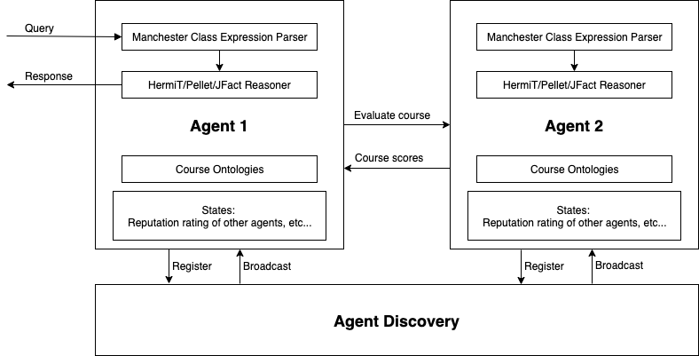

# Project Description

## Agent Design

## Agent Architecture

Rational agents come into the following four types:
* Reflex agents
* Reflex agents with state
* Goal-based agents
* Utility-based agents
* BDI agents

The course planner is built upon the architecture of utility-based agents.

The states consist of world states and agent states:
* World states:
	* Neighbouring agents
	* Expertise of the querying agent
	* Sociability of the querying agent
* Agent states:
	* Courses already studied
	* Available timeslots in its calendar

The actions are as below:
* Take a course

The utilities can be calculated as below:
* Happiness = Count(Taken courses) * Overlap(Courses taken by its friends) * Evaluation(Taken courses)

## Scenario

## Evaluation

* Correctness ratio

## Performance Metrics

## References

* https://owlcs.github.io/owlapi/apidocs_5/index.html