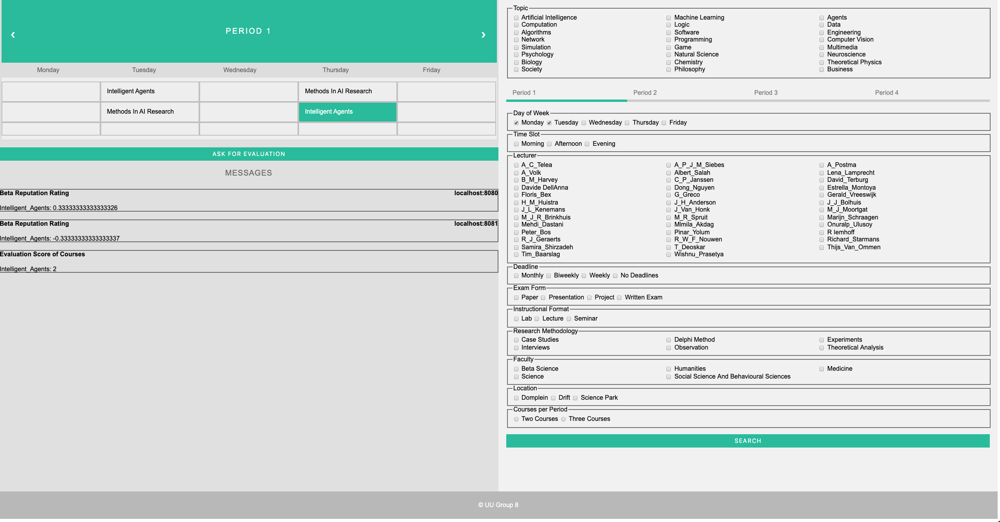

# Project Description

## To-Do List
- [x] UI to query based on the current ontologies and scenarios
- [ ] a utility function - data
- [ ] reasoning process - data
- [x] performance metrics - data
- [ ] Google calendar & Google assistant integration, etc...
- [ ] "Similar Courses" search function implementation
- [ ] min=2, max=3 courses per term

## User Guide

The UI is as below:
* Query can be performed in the Manchester OWL syntax, and some examples:
	* not (isTaughtOn some Morning)
	* isTaughtBy value R_Iemhoff or isTaughtBy value Davide_DellAnna
	* Course and isTaughtInPeriod value Period_4
	* Course and not (isTaughtInPeriod value Period_4)
* Register can be performed by clicking the "Register" button when one or multiple courses have been checked.
* "Ask for Evaluation" can be performed only in the multi-agent environment.

To run this application in the one-agent environment:
1. Run the project [course-planner](./course-planner) per README.md inside
2. Run the project [agent-discovery](./agent-discovery) per README.md inside
3. Open and browser and go to this link: http://localhost:8080

## Agent Design

## Agent Architecture

**Rational agents** come into the following five types:
* Reflex agents
* Reflex agents with state
* Goal-based agents
* Utility-based agents
* BDI agents

The course planner is built upon the architecture of utility-based agents.

The **state** consists of agent state and world state, which is able to be perceived by the sensors from the environment:
* **world state**
	* S1: Online neighbouring agents
	* S2: Course evaluation from neighbouring agents
* **agent state**
	* S3: Total registered courses
	* S4: Available time slots in the calendar
	* S5: Reputation rating of neighbouring agents

The **action** stands for the action that the agent is able to take, which will influence the internal agent states and the environment by the actuators:
* A1: Register for a course
* A2: Ask for the evaluation of a course from neighbouring agents
* A3: Answer the evaluation of a course from neighbouring agents
* A4: Give positive or negative feedback for evaluations of courses from neighbouring agents

How the world evolves (which is perceived by the sensors) and what my actions do (which is actuated by the actuators) will both have an effect on the world and agent states:

| Sensors                        | Actuators                                                                                                                       | State                                                                  |
|--------------------------------|---------------------------------------------------------------------------------------------------------------------------------|------------------------------------------------------------------------|
| E1: Neighbouring agents online |                                                                                                                                 | S1: Online neighbouring agents                                         |
|                                | A2: Ask for the evaluation of a course from neighbouring agents   A3: Answer the evaluation of a course from neighbouring agents | S2: Course evaluation from neighbouring agents                         |
|                                | A1: Register for a cours                                                                                                        | S3: Total registered courses   S4: Available time slots in the calendar |
|                                | A4: Give positive or negative feedback for evaluations of courses from neighbouring agents                                      | S5: Reputation rating of neighbouring agents                           |

The **utility** is calculated as below:
* Utility =  0.8*(number of requirements respected / total number of requirements) + 0.2*(sum(1 if there is at least a friend in course i, 0 otherwise)  / number of courses)

The **knowledge base** is imported from the ontologies, which contains the following consistent facts about a student and courses, which will be queried by the agent and inference will be drawn based on the chosen reasoner: HermiT, Pellet or Fact++:
* Facts about a student:
	* Preferences for a certain lecture, day and topic
	* Friends
* Facts about a course:
	* Lecturers
	* Faculties
	* Research Methodologies
	* Topics
	* Time slots

**Computational trust** comes into the following three types:
* Local trust
* Institutional trust
* Social trust

**Beta-reputation system** is based on social trust: 
* Beta density function is used for binary events
* Count the past occurrences and decide based on frequency

Formula to calculate **reputation** and **opinion** is as below:
* r = occurrences of positive feedback, s = occurrences of negative feedback
* α = r + 1, β = s + 1

Y's **reputation** calculated by X:
* **reputation expected**: E(p) = α / α + β, the result is between [0, 1]
* **reputation rating**: Rep = (E(p) - 0.5) * 2, the result is between [-1, 1]

X's **opinion** about Y for **belief**, **disbelief**, **uncertainty**: w = (b, d, u)
* b = r / (r + s + 2)
* d = s / (r + s + 2)
* u = u / (r + s + 2)
* mapping from opinion to reputation: Rep(r, s) = (2*b/u, 2*d/u)

Combining opinion: X's opinion about Y = (bxy, dxy, uxy), Y's opinion about Z = (byz, dyz, uyz), and X's opinion about Z = (bxz, dxz, uxz):
* bxz = bxy * byz
* dxz = bxy * dyz
* uxz = dxy + uxy + bxy * uyz

**Forgetting** factor based on timestamp i is as below:
* r = r1 + ... + rn, s = s1 + ... + sn
* r = (r1 + ... + rn) ∗ λ(n−i), s = (s1 + ... + sn) ∗ λ(n−i), where 1 ≤ i ≤ n, 0 ≤ λ ≤ 1

**Rating-based approaches**:
* Sensitive to subjectivity
* Sensitive to variation in context 

**Ontology-based experiences**:
* Gaussian Model: It estimates the probability of satisfaction
* Case-Based Reasoning (CBR): Score for experience = recency * similarity * satisfaction

## Scenario

## Evaluation

* Correctness ratio

## Performance Metrics

## References

* https://owlcs.github.io/owlapi/apidocs_5/index.html
